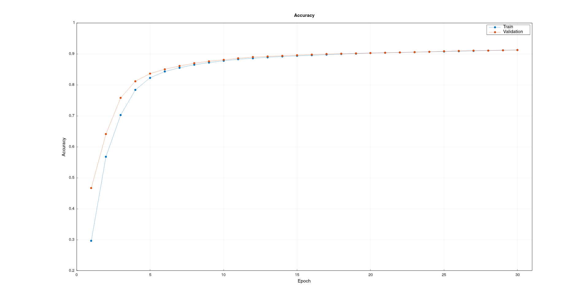
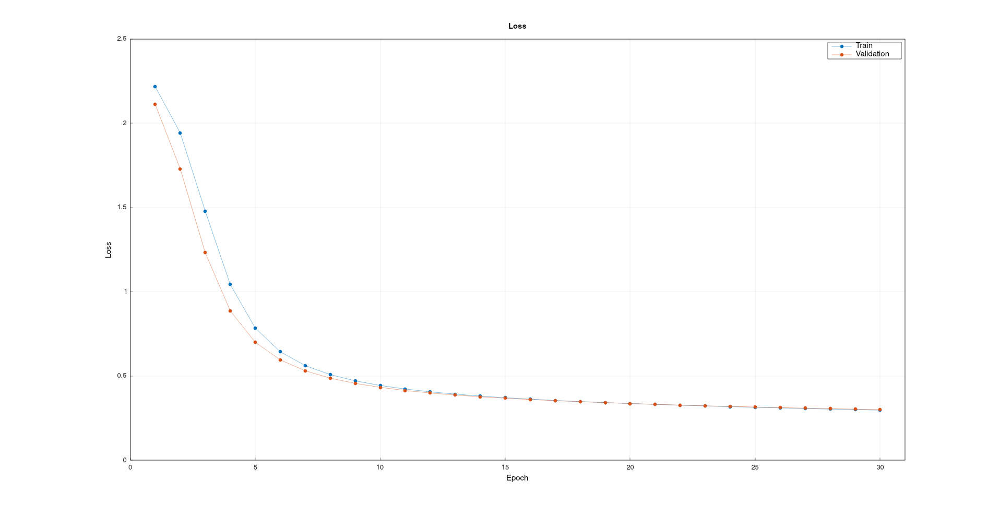

# Neural Net using C++

This project is an implementation of a simple neural network with two hidden layers, made specifically to classify digits in the MNIST dataset. It is mostly similar to the NumPy neural net with some minor differences in the user interface and the inability to load from pickle files.

For the complete technical overview see [link](https://github.com/Keith-Dao/Neural-Net-From-Scratch/blob/main/README.md).

## 1. Dependencies

The following libraries are required.

| Library      | Version | Link                                                                       | Install using CMake |
| ------------ | ------- | -------------------------------------------------------------------------- | :-----------------: |
| Eigen        | 3.4.0   | https://gitlab.com/libeigen/eigen/-/releases/3.4.0                         |         ✔️          |
| JSON         | 3.11.2  | https://github.com/nlohmann/json/releases/tag/v3.11.2                      |         ✔️          |
| yaml-cpp     | 0.6.3   | https://github.com/jbeder/yaml-cpp/releases/tag/yaml-cpp-0.6.3             |         ✔️          |
| matplot++    | 1.1.0   | https://github.com/alandefreitas/matplotplusplus/releases/tag/v1.1.0       |         ✔️          |
| indicators   | 2.3     | https://github.com/p-ranav/indicators/releases/tag/v2.3                    |         ✔️          |
| OpenCV       | 4.7.0   | https://github.com/opencv/opencv/releases/tag/4.7.0                        |         ✔️          |
| tabulate     | 1.5     | https://github.com/p-ranav/tabulate/releases/tag/v1.5                      |         ✔️          |
| Termcolor    | 2.1.0   | https://github.com/ikalnytskyi/termcolor/archive/refs/tags/v2.1.0.zip      |         ✔️          |
| GNU readline | 8.2     | http://git.savannah.gnu.org/cgit/readline.git/snapshot/readline-8.2.tar.gz |         ❌          |
| ncurses      | 6.4     | https://ftp.gnu.org/gnu/ncurses/ncurses-6.4.tar.gz                         |         ❌          |

The following are also required.

| Dependencies | Version |
| ------------ | ------- |
| g++          | 12.2.1  |
| cmake        | 3.26.3  |
| gnuplot      | 5.4     |

## 2. Setup

For above libraries marked as "Install using CMake":

1. Download the required libraries above
2. Extract the files
3. Change directories to the extracted folder
4. Run `cmake -B build`
5. Change directories to `build`
6. Run `make install`, this may require elevated permissions

For above libraries not marked as "Install using CMake":

1. Download there required libraries above
2. Extract the files
3. Change directories to the extracted folder
4. Run `./configure`
5. Run `make install`, this may require elevated permissions
6. On Linux systems, you may need to run `ldconfig` with elevated permissions

For matplot++:

1. Follow these instructions: https://alandefreitas.github.io/matplotplusplus/integration/install/build-from-source/dependencies/

For the project:

1. Run `cmake -B build`
2. Change directories to `build`
3. Run `make`

## 3. Configuration

To run the driver file:

- Update the existing `config.yaml` file

**OR**

- Create a yaml file with the following template:

```yaml
---
# Data
train_path: # Training image path
train_validation_split: # Training validation split
test_path: # Test image path
file_formats:# File formats as a list
  # - .png
  # - .jpg
batch_size: # Batch size

# Training
epochs: # Training epochs
learning_rate: # Learning rate

# Model
model_path: # Model load path

# Metrics
train_metrics:# Training metrics as a list
  # - loss
validation_metrics:# Validation metrics as a list
  # - loss
test_metrics:# Testing metrics as a list
  # - loss
```

### 3.1. Data Configuration

**train_path**: string

- The path to the training images
- Can be a relative or absolute path
- Optional, skips training if not provided

---

**train_validation_split**: float

- The training data split
- Must be in the range [0, 1]
- If 0, all data will be used for validation
- If 1, all data will be used for training
- Optional, defaults to 0.7

---

**test_path** str

- The path to the testing images
- Can be a relative or absolute path
- Optional, skips test inferencing if not provided

---

**file_formats**: list[str]

- File formats to be included as part of the dataset
- Must include "." as part of the value i.e. ".png" is valid but "png" is not valid
- Optional, defaults to only include ".png"

---

**batch_size**: int

- The batch size to load the training and test data
- Must be an positive integer
- Optional, defaults to 1

### 3.2. Training configuration

**epochs**: int

- The number of epochs to train the model
- Must be an positive integer
- Optional, defaults to 1

---

**learning_rate**: float

- The learning rate to train the model
- Must be a positive number
- Optional, defaults to 1.0e-4

### 3.3. Model

**model_path**: string

- The path to the saved model attributes to load
- Can be a relative or absolute path
- Optional, defaults to untrained model

### 3.4. Metrics

Valid metrics include:

- loss
- accuracy
- precision
- recall
- f1_score

**NOTE**:

- The selected metrics must exactly match the above
- Only following metrics will be visualised as a history graph:
  - loss
  - accuracy

---

**train_metrics**: list[str]

- Metrics to track during training
- Only accepts the valid metrics listed above
- Optional, defaults to no metrics if none are provided

---

**validation_metrics**: list[str]

- Metrics to track during validation
- Only accepts the valid metrics listed above
- Optional, defaults to no metrics if none are provided

---

**test_metrics**: list[str]

- Metrics to track during testing
- Only accepts the valid metrics listed above
- Optional, defaults to no metrics if none are provided and skips testing

## 4. Usage

After following the steps listed in [Setup](#2-setup) and [Configuration](#3-configuration), run the driver script with the following (The binary would be compiled in the build folder.):

```
./NeuralNetwork [-p] [config_file]
```

### 4.1. Arguments:

**config_file**:

- The path the config file
- If omitted, the script will default to searching for `config.yaml` in the current working directory

**-p** or **--prediction-mode**:

- When present, the driver script will skip all training and testing to the prediction mode to perform prediction on individual images
- If omitted, training and testing will be commenced

### 4.2. Prediction mode

- Only supported by models that have stored the classes, which included trained models or loaded pre-trained models
- Only files formats listed in the configuration file will be processed

## 5. Remarks

Training with a learning rate of `5.0e-3` over 30 epochs with a 70% train validation split and batch size of 256, resulted in the following test metrics.

| Loss   | Accuracy |
| ------ | -------- |
| 0.2941 | 0.9154   |

| Class | Precision | Recall | F1 score |
| ----- | --------- | ------ | -------- |
| 0     | 0.9346    | 0.9776 | 0.9556   |
| 1     | 0.9626    | 0.9753 | 0.9689   |
| 2     | 0.9142    | 0.8983 | 0.9062   |
| 3     | 0.8967    | 0.9020 | 0.8993   |
| 4     | 0.9082    | 0.9267 | 0.9173   |
| 5     | 0.8653    | 0.8789 | 0.8721   |
| 6     | 0.9359    | 0.9290 | 0.9324   |
| 7     | 0.9139    | 0.9290 | 0.9214   |
| 8     | 0.9064    | 0.8450 | 0.8746   |
| 9     | 0.9044    | 0.8811 | 0.8926   |

The following are the training and validation histories for accuracy and loss respectively.

| Accuracy history                              | Loss history                          |
| --------------------------------------------- | ------------------------------------- |
|  |  |

Similar to what was observed in the NumPy version, the model does not appear to be overfitting and generalises fairly well. The training time of the C++ version is also noticeable faster (~75%), from approximately 7 seconds to 4 seconds for 165 minibatches of 256 images without using the GPU.

Similar to the python version, there are further architecture and pipeline changes could be implemented to improve the model's performance, which will be discussed in the complete technical overview [here](https://github.com/Keith-Dao/Neural-Net-From-Scratch/blob/main/README.md#4-remarks).
